### ⚙️ Pipeline: Daily Routine (Phase 1)

**Phase 0: Инициализация (Boot)**

- Нажать `Alt + D` (или запустить скрипт).
    
- Отрендерить `daily-quest-YYYY-MM-DD.md`.
    
- Считать план на день: 4 основные задачи в верхнем блоке + пул задач на поддержку (SR) в нижнем.
    

**Phase 1: Рабочий цикл (The Loop) — Повторить 4 раза**

1. **Фокус (Fetch):** Взять ОДИН предмет из списка (например, JS). Все остальное перестает существовать.
    
2. **Среда (Environment):** Запустить `mkdisc.sh`. Сгенерировать изолированную папку для кода (например, `2026-03-07_15-00-drill-js-m0`).
    
3. **Исполнение (Execute):** Открыть WebStorm. Отработать код/дрил.
    
4. **Запись телеметрии (Log):** Вернуться в `daily-quest`. Записать потраченное время в Frontmatter (например, `js:: 60`).
    
5. **Обновление стейта (State Update):** Перейти в файл текущего модуля (например, `js-m0-0.md`).
    
    - Увеличить `rep_count` на +1 (если фаза "дрочки").
        
    - Либо увеличить `sr_step` (если фаза "поддержки").
        
    - Приплюсовать время к `duration`.
        
    - Переставить `next_review` на нужную дату.
        
6. **Добивка (SR Check):** Посмотреть в нижний блок дневного квеста. Если там висит задача на повторение _по текущему предмету_ (JS) — выполнить ее сейчас, пока контекст загружен в мозг. Обновить ее стейт.
    
7. **Фиксация (Micro-commit):** Зайти в терминал. Сделать локальный коммит (например, `git commit -m "drill: js m0 set 1 rep 4"`). Запушить на Gitea.
    

**Phase 2: Завершение (Shutdown)**

- Убедиться, что цикл выполнен для всех 4 предметов (English, JS, Logic/HC, Utils).
    
- Проверить KPI в дневном документе (отношение `work` к `waste`).
    
- Сделать финальный глобальный коммит хранилища: `git commit -m "chore: close daily quest 2026-03-07"`.
    
- Запушить всё на сервер.
    
- Закрыть WebStorm и Obsidian. Конец смены.
    

---

Этот алгоритм не дает сбоев, потому что в нем нет неопределенности. Ты всегда знаешь, какой следующий шаг.

```mermaid
graph TD
    %% Phase 0: Initialization
    Start((START)) --> P0["<b>Phase 0: Initialization</b><br/>Alt + D: Generate daily-quest.md<br/>Fetch 4 Main + SR Tasks"]
    
    P0 --> LoopStart{Start Loop:<br/>Iterate 4 times}

    %% Phase 1: The Loop
    LoopStart --> TaskSel["Select 1 Task<br/><i>e.g., JS, English, HC, Utils</i>"]
    TaskSel --> Env["Run <b>mkdisc.sh</b><br/>Generate daily-drill folder"]
    Env --> WebStorm["<b>WebStorm / IDE</b><br/>Execute Code / Complete Drill"]
    WebStorm --> LogTime["Record Time in <b>daily-quest</b><br/><i>e.g., js:: 60</i>"]
    
    LogTime --> OpenMod["Open Module File<br/><i>e.g., js-m0-0.md</i>"]
    OpenMod --> UpdateBase["Update 'duration' & 'next_review'"]
    
    UpdateBase --> CheckPhase{rep_count < 7?}
    CheckPhase -- "YES" --> IncRep["Increment <b>rep_count</b> +1<br/><i>(Phase 1: Drill)</i>"]
    CheckPhase -- "NO" --> IncSR["Increment <b>sr_step</b> +1<br/><i>(Phase 2: Support)</i>"]
    
    IncRep --> SRCheck
    IncSR --> SRCheck
    
    SRCheck{"Any SR Task for<br/>this subject today?"}
    SRCheck -- "YES" --> DoSR["Perform SR Task &<br/>Update its State"]
    SRCheck -- "NO" --> MicroGit["<b>Git Commit & Push</b><br/><i>Micro-push of current work</i>"]
    DoSR --> MicroGit

    MicroGit --> LoopEnd{All 4<br/>complete?}
    LoopEnd -- "NO" --> LoopStart
    
    %% Phase 2: Shutdown
    LoopEnd -- "YES" --> P2["<b>Phase 2: Shutdown</b>"]
    P2 --> KPI["Review Daily KPI<br/>Work vs Waste"]
    KPI --> FinalGit["Final <b>git push</b><br/>Vault Sync"]
    FinalGit --> Shutdown["Close WebStorm & Obsidian"]
    Shutdown --> End((END ROUTINE))

    %% Styling
    style Start fill:#f9f,stroke:#333,stroke-width:2px
    style End fill:#f9f,stroke:#333,stroke-width:2px
    style P0 fill:#4dabf7,stroke:#333,stroke-width:2px
    style P2 fill:#4dabf7,stroke:#333,stroke-width:2px
    style CheckPhase fill:#e5c07b,stroke:#333,stroke-width:2px
    style LoopStart fill:#e5c07b,stroke:#333,stroke-width:2px
    style SRCheck fill:#e5c07b,stroke:#333,stroke-width:2px
    style MicroGit fill:#46bc46,stroke:#333,stroke-width:2px
    style FinalGit fill:#46bc46,stroke:#333,stroke-width:2px
```

