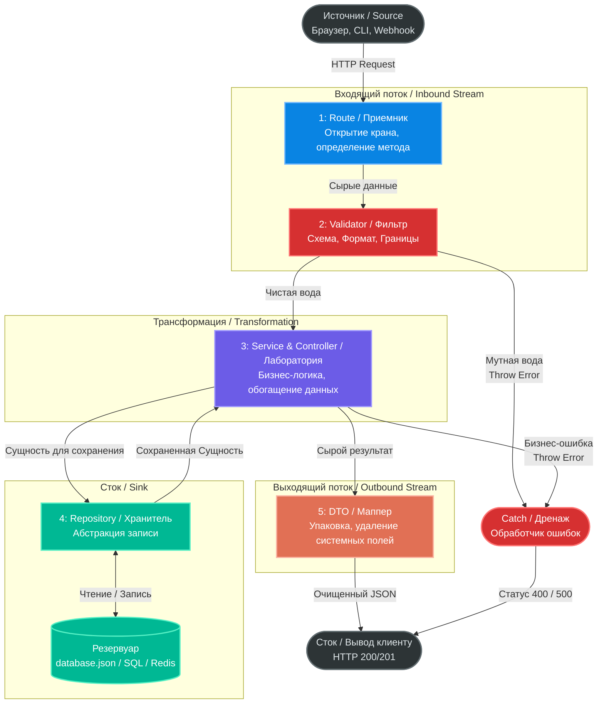

```
const fastify = require('fastify')({ logger: true });

// --- 4. REPOSITORY (Sink) ---
// Mock database interaction
const saveGreetingToDB = async (greetingText) => {
    // Simulating writing to database.json
    return { 
        internal_id: 98765, 
        system_node: 'node-worker-1',
        text: greetingText 
    };
};

// --- 3. SERVICE (Transformation) ---
// Business logic: how exactly do we greet?
const createGreetingMessage = (name) => {
    const timestamp = Date.now();
    return `Hello, ${name}! Timestamp: ${timestamp}`;
};

// --- 1. ROUTE & 2. VALIDATOR (Source & Inbound) ---
fastify.get('/greet', {
    schema: {
        querystring: {
            type: 'object',
            required: ['name'],
            properties: {
                name: { type: 'string', minLength: 3 }
            }
        }
    }
}, async (request, reply) => {
    try {
        // Water entered the system cleanly. Validation passed.
        const userName = request.query.name;

        // Step 3: Transformation
        const rawMessage = createGreetingMessage(userName);

        // Step 4: Storage
        const dbRecord = await saveGreetingToDB(rawMessage);

        // --- 5. DTO (Outbound) ---
        // Hiding internal_id and system_node from the user
        const responseDTO = {
            success: true,
            greeting: dbRecord.text
        };

        // Output to the user
        return reply.code(200).send(responseDTO);

    } catch (error) {
        // --- CATCH (Drain) ---
        request.log.error(error);
        return reply.code(500).send({ error: 'Internal Server Error' });
    }
});
```


### Как это ложится на нашу блок-схему:

1. **Route (Приемник):** Мы слушаем метод `GET` по адресу `/greet`. Кран открыт.
    
2. **Validator (Фильтр):** Блок `schema`. Если кто-то попытается дернуть `/greet?name=Yo` (меньше 3 символов) или просто `/greet`, Fastify сам перекроет кран и выдаст `400 Bad Request`. Контроллер даже не запустится, ресурсы CPU сэкономлены.
    
3. **Service (Лаборатория):** Функция `createGreetingMessage`. Именно здесь живет логика приложения. Мы берем "сырое" имя и обогащаем его словом "Hello" и текущим временем.
    
4. **Repository (Хранитель):** Функция `saveGreetingToDB`. Симулирует запись в базу. База всегда возвращает какие-то свои системные данные (в нашем случае `internal_id` и `system_node`).
    
5. **DTO (Маппер):** Мы собираем финальный объект `responseDTO`. Мы **не отправляем** пользователю `dbRecord` целиком, потому что клиенту не нужно знать внутренний ID записи и имя ноды кластера. Мы отдаем только очищенную "воду" — статус и само приветствие.